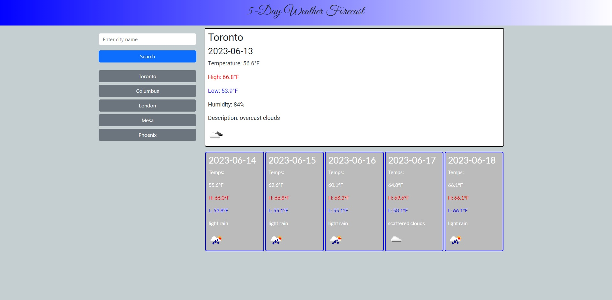

# 5-Day-Weather-Forecast

## DESCRIPTION

This is a Weather Forecast app that gives searched city forecasts for up to five days.  It was created to improve my familiarity with "fetch" requests in JavaScript.  

## USAGE

[Link to Weather Forecast Page](https://yajiit.github.io/5-Day-Weather-Forecast/index.html)
To get a weather forecast, type the desired city into the search bar.  The current forecast should be displayed above the others, while up to five days of forecasts are present below.  When a city name is successfully searched it is added to the Search History.  Up to five previous cities will be saved as buttons to quickly search again.  If there is a city in Search History when the page is loaded the most recently searched history will have its current forecast displayed.

## FEATURES

- 5 day Weather forecasts for any searched city
- Store up to five previously searched cities in Search History
- Displays most recently searched city on page load
- Dynamic background changes color based on current forecast

## SCREENSHOT

## LICENSE

MIT License

Copyright (c) 2023 Yajiit

Permission is hereby granted, free of charge, to any person obtaining a copy
of this software and associated documentation files (the "Software"), to deal
in the Software without restriction, including without limitation the rights
to use, copy, modify, merge, publish, distribute, sublicense, and/or sell
copies of the Software, and to permit persons to whom the Software is
furnished to do so, subject to the following conditions:

The above copyright notice and this permission notice shall be included in all
copies or substantial portions of the Software.

THE SOFTWARE IS PROVIDED "AS IS", WITHOUT WARRANTY OF ANY KIND, EXPRESS OR
IMPLIED, INCLUDING BUT NOT LIMITED TO THE WARRANTIES OF MERCHANTABILITY,
FITNESS FOR A PARTICULAR PURPOSE AND NONINFRINGEMENT. IN NO EVENT SHALL THE
AUTHORS OR COPYRIGHT HOLDERS BE LIABLE FOR ANY CLAIM, DAMAGES OR OTHER
LIABILITY, WHETHER IN AN ACTION OF CONTRACT, TORT OR OTHERWISE, ARISING FROM,
OUT OF OR IN CONNECTION WITH THE SOFTWARE OR THE USE OR OTHER DEALINGS IN THE
SOFTWARE.